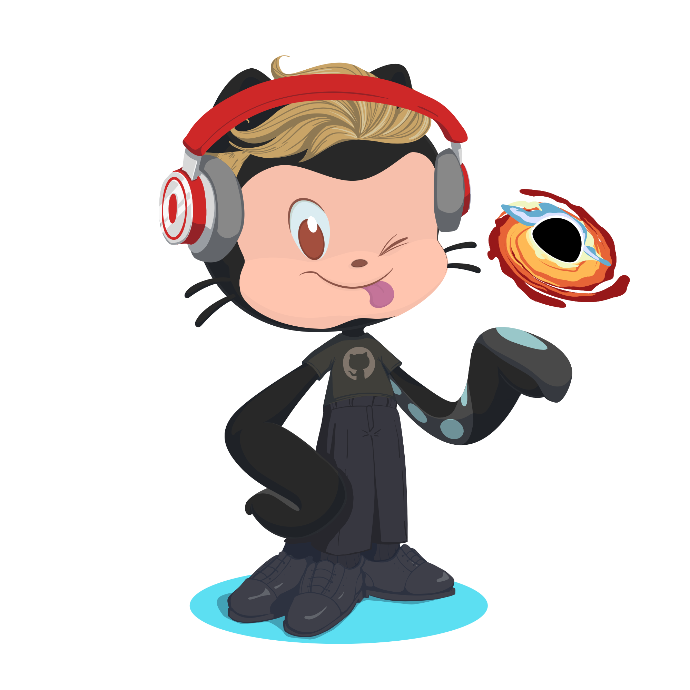

<div align="center">

<table border="0" cellspacing="0" cellpadding="0">
<tr>
<td valign="middle">

```
███╗   ███╗██╗ ██████╗██╗  ██╗ █████╗ ███████╗██╗
████╗ ████║██║██╔════╝██║  ██║██╔══██╗██╔════╝██║
██╔████╔██║██║██║     ███████║███████║█████╗  ██║
██║╚██╔╝██║██║██║     ██╔══██║██╔══██║██╔══╝  ██║
██║ ╚═╝ ██║██║╚██████╗██║  ██║██║  ██║███████╗███████╗
╚═╝     ╚═╝╚═╝ ╚═════╝╚═╝  ╚═╝╚═╝  ╚═╝╚══════╝╚══════╝
```

</td>
<td valign="middle" width="180">

</td>
</tr>
</table>


Hey, **I'm Michael**, I do everything ML :)

[](https://x.com/Tech_guyMike)
[](https://linkedin.com/in/michael-rusudev)
[](https://kaggle.com/mrpies)
[](https://michaelml.dev)
[](mailto:mickirusu@gmail.com)

</div>

---

## a bit about me

Honors CS + Data Science student @ UCF, 5+ years deep in Machine Learning and <a href="https://github.com/search?q=%23opensource"><b>#opensource</b></a>. 

Across that time I've gone from training my first classifier to building production ML pipelines, publishing models, and running research across two labs. I've touched everything from data wrangling and feature engineering to model architecture, deployment, and edge inference. 

I'm most interested in the boundary between machine intelligence and human intuition (how models perceive the world, where they fail, and what that tells us about how we think). I also do work on other areas depending on the task

<table border="0" cellspacing="0" cellpadding="8">
<tr>
<td><b>🔬 VARLAB</b> @ UCF</td>
<td>Researching how JEPA architectures and VLMs compare to actual human perception in XR environments</td>
</tr>
<tr>
<td><b>🧠 KSRP</b> @ UCF</td>
<td>Building on-device RAG pipelines with Knowledge Graphs for LLM personalization on edge hardware</td>
</tr>
<tr>
<td><b>🛠️ Knight Hacks</b></td>
<td>Workshop Director, running technical workshops and helping organize hackathons</td>
</tr>
<tr>
<td><b>🤖 OpenAI</b></td>
<td>Campus Ambassador @ UCF, promoting responsible AI literacy and practical adoption on campus</td>
</tr>
<tr>
<td><b>🔎 Perplexity AI</b></td>
<td>Campus Ambassador @ UCF, organizing demos and building awareness of AI-powered research tools</td>
</tr>
</table>

🤗 I'm a big believer in open source. Models, tools, experiments, if something I build can be useful to someone else, it should be out there. Full stop.


---

## 🔬 what I'm building right now

| | |
|--|------|
| 🧠 | **ML research** — exploring model internals, edge inference, and the overlap between machine perception and human cognition. |
| 💻 | **Open source software** — if I built it and it works, it should be public. |
| 🌐 | **Open source models** — releasing models on Hugging Face & GitHub as I go. |
| 🔧 | **Side projects** — always have something running in the background. hardware, tools, experiments. |

---

## ⚙️ tech I use


[](https://www.kaggle.com/mrpies)


---

## 📊 github stats

<div align="center">


</div>

<div align="center">

[](https://git.io/streak-stats)

</div>


## 🎯 Kaggle

<div align="center">

[](https://www.kaggle.com/mrpies)
[](https://www.kaggle.com/mrpies)
[](https://www.kaggle.com/mrpies)
[](https://www.kaggle.com/mrpies)


---

<div align="center">

curiosity is the most powerful thing you own — [michaelml.dev](https://michaelml.dev)

</div>
