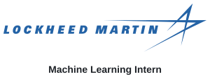

  
  &nbsp;
  
  &nbsp;
  

<h1 align="center">hello world, i'm michael :)</h1>

  <strong>honors cs + data science @ ucf</strong>

  interested in ML, mathematics, and data. 
  <em>i like training complex models, experimenting w/ hpc, serving/scaling those models</em>

  i also love open-source : )

  
  &nbsp;&nbsp;
  
  &nbsp;&nbsp;
  
  &nbsp;&nbsp;
  
  &nbsp;&nbsp;
  

 

<h3 align="center">previously interned at</h3>

  <a href="https://www.lockheedmartin.com/">
    <picture>
      <source
        media="(prefers-color-scheme: dark)"
        srcset="assets/experience/lockheed-martin-dark.svg"
      >
      <source
        media="(prefers-color-scheme: light)"
        srcset="assets/experience/lockheed-martin-light.svg"
      >
      
    </picture>
  </a>
  &nbsp;&nbsp;
  <a href="https://www.softcomputer.com/">
    <picture>
      <source
        media="(prefers-color-scheme: dark)"
        srcset="assets/experience/scc-soft-computer-dark.svg"
      >
      <source
        media="(prefers-color-scheme: light)"
        srcset="assets/experience/scc-soft-computer-light.svg"
      >
      
    </picture>
  </a>

 

<h3 align="center">a few tools i reach for</h3>

  <code>Python</code> &nbsp;
  <code>PyTorch</code> &nbsp;
  <code>C++</code> &nbsp;
  <code>CUDA</code> &nbsp;
  <code>Transformers</code> &nbsp;
  <code>Polars</code> &nbsp;
  <code>Docker</code> &nbsp;
  <code>Linux</code>

  
the rest of the toolbox

   

  

    <strong>methods</strong> 
    <code>Fine-Tuning</code>
    <code>Model Distillation</code>
    <code>Distributed Systems/Training</code>
    <code>Statistical Tests</code>
    <code>A/B Testing</code>
    <code>RL</code>
    <code>Mixed Precision</code>
    <code>XAI</code>
    <code>RAG</code>
    <code>CV</code>
    <code>NLP</code>
    <code>Embedded Systems</code>
    <code>Data Structures &amp; Algorithms</code>
    <code>Object-Oriented Programming</code>
    <code>CI/CD</code>
  

  

    <strong>ml &amp; data</strong> 
    <code>PyTorch</code>
    <code>TensorFlow</code>
    <code>Keras</code>
    <code>scikit-learn</code>
    <code>XGBoost</code>
    <code>LightGBM</code>
    <code>Transformers</code>
    <code>Hugging Face</code>
    <code>OpenCV</code>
    <code>NumPy</code>
    <code>Polars</code>
    <code>pandas</code>
    <code>SciPy</code>
    <code>Matplotlib</code>
    <code>Seaborn</code>
    <code>NoSQL</code>
  

  

    <strong>low-level systems</strong> 
    <code>C++</code>
    <code>CUDA</code>
    <code>Metal</code>
    <code>ONNX</code>
    <code>TensorRT</code>
    <code>Linux/Unix</code>
    <code>ROS 2</code>
    <code>Arduino</code>
    <code>Unity</code>
  

  

    <strong>infrastructure</strong> 
    <code>Apache Spark</code>
    <code>Databricks</code>
    <code>Docker</code>
    <code>Kubernetes</code>
    <code>Kubeflow</code>
    <code>MLflow</code>
    <code>Flask</code>
    <code>FastAPI</code>
    <code>Apache Kafka</code>
    <code>BigQuery</code>
    <code>PostgreSQL</code>
    <code>MongoDB</code>
    <code>Redis</code>
    <code>AWS</code>
    <code>Azure</code>
    <code>Google Cloud (GCP)</code>
    <code>Git</code>
    <code>CI/CD</code>
    <code>ETL</code>
    <code>vLLM</code>
  

  

    <strong>languages</strong> 
    <code>Python</code>
    <code>C++</code>
    <code>C</code>
    <code>SQL</code>
    <code>R</code>
    <code>Bash</code>
    <code>Java</code>
    <code>Go</code>
    <code>Rust</code>
    <code>C#</code>
    <code>JavaScript</code>
    <code>TypeScript</code>
  

  

    <strong>tooling &amp; workflow</strong> 
    <code>Jupyter</code>
    <code>Anaconda</code>
    <code>Kaggle</code>
    <code>JSON</code>
    <code>.NET</code>
    <code>GitHub Actions</code>
    <code>VS Code</code>
    <code>Neovim</code>
  

 

  <em>curiosity is the most powerful thing you own.</em>
  &nbsp;
  <code>neovim, btw.</code>

