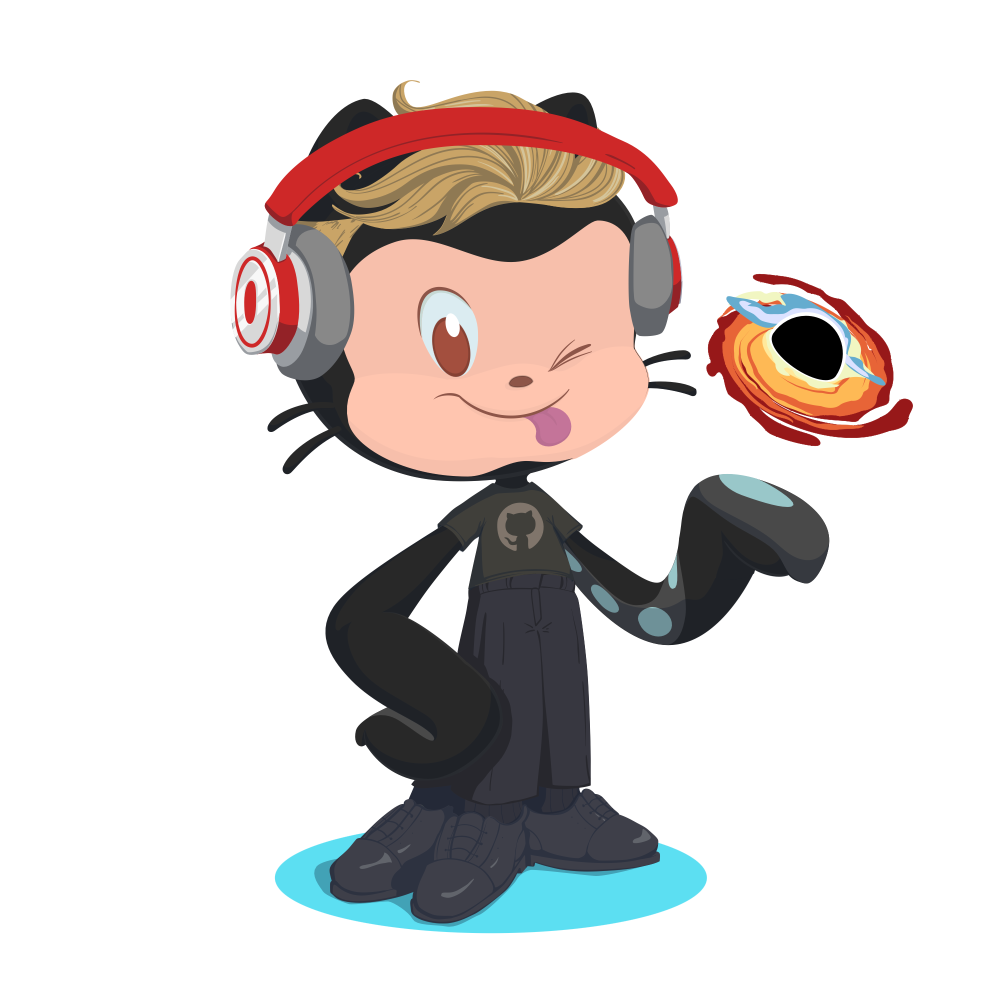

<div align="center">

<table border="0" cellspacing="0" cellpadding="0">
<tr>
<td valign="middle">

```
███╗   ███╗██╗ ██████╗██╗  ██╗ █████╗ ███████╗██╗
████╗ ████║██║██╔════╝██║  ██║██╔══██╗██╔════╝██║
██╔████╔██║██║██║     ███████║███████║█████╗  ██║
██║╚██╔╝██║██║██║     ██╔══██║██╔══██║██╔══╝  ██║
██║ ╚═╝ ██║██║╚██████╗██║  ██║██║  ██║███████╗███████╗
╚═╝     ╚═╝╚═╝ ╚═════╝╚═╝  ╚═╝╚═╝  ╚═╝╚══════╝╚══════╝
```

</td>
<td valign="middle" width="180">

</td>
</tr>
</table>


Hey, **I'm Michael**, I do everything ML :)

[](https://x.com/reach_mrpie)
[](https://linkedin.com/in/michael-rusudev)
[](https://kaggle.com/mrpies)
[](https://michaelml.dev)
[](mailto:mickirusu@gmail.com)

</div>


## a bit about me

Honors CS + Data Science student @ UCF, 5+ years deep in Machine Learning and <a href="https://github.com/search?q=%23opensource"><b>#opensource</b></a>. 

🤗 I'm a big believer in open source. Models, tools, experiments, if something I build can be useful to someone else, it should be out there. Full stop. I also use NeoVim btw.


## ⚙️ tech I use


[](https://www.kaggle.com/mrpies)


---


<div align="center">

curiosity is the most powerful thing you own — [michaelml.dev](https://michaelml.dev)

</div>
